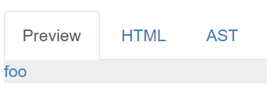
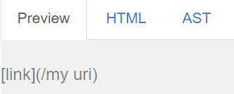

Lab Report 4
============

Back to [home](../index).

# Comparing implementations of markdown-parse

Implementations compared are from Week 9's [markdown-parse](https://github.com/ucsd-cse15l-w22/markdown-parse) directory, and [this](https://github.com/zfxd/markdown-parse/tree/78a7b9ef78ac8172c052ce9060935e51917c1b8f) implementation of markdown-parse.

Using the following bash script, I iterated through every file in the test-files folder, running the MarkdownParse implementations on each.

```
for file in test-files/*.md;
do
  echo -n $file = 
  java MarkdownParse $file
done
```

I saved each implementation's output using the command `bash script.sh > labResults.txt` and `bash script.sh > myResults.txt`. Then, I called the `diff` command on them to compare any differences in their output for the next step.

## Difference 1

The first difference between both implementations occured for test file `22.md`:

```
PROVIDED IMPLEMENTATION
< test-files/22.md =[]
---
MY IMPLEMENTATION
> test-files/22.md =[/bar\* "ti\*tle"]
```

Here is `22.md`, for reference.

```
[foo](/bar\* "ti\*tle")
```

According to the [CommonMark demo site](https://spec.commonmark.org/dingus/), this is indeed a valid link, with destination `/bar*` and title `title`:



In this case, both implementations were incorrect. Professor Joe's implementation did not pick up any links, while mine picked up the links but did not recognize the link's title. It also did not exclude the backslashes which were intended as escape characters.

Professor Joe's implementation did not pick up any links because of the space inside the provided link. In lines 74 to 21 of the provided `MarkdownParse.java` file,

```
            String potentialLink = markdown.substring(openParen + 1, closeParen).trim();
            if(potentialLink.indexOf(" ") == -1 && potentialLink.indexOf("\n") == -1) {
                toReturn.add(potentialLink);
                currentIndex = closeParen + 1;
            }
            else {
                currentIndex = currentIndex + 1;
            }
```

Any potential link which contains a space is immediately skipped, which does not take into account the valid markdown syntax for a link with an optional title, which includes spaces: `[text] (dest "title")`

So, in order to fix the code for this implementation of MarkdownParse, instead of skipping over any potential link which contains a space inside of it, we should first check that a link that contains a single space follows valid Markdown syntax for providing a title (a set of open and close quotation marks that immediately follow the space), and only skip over links with spaces that do not adhere to this syntax.


## Difference 2

Another difference between the implementations' outputs occurs at `487.md`:

```
PROVIDED IMPLEMENTATION
< test-files/487.md =[]
---
MY IMPLEMENTATION
> test-files/487.md =[/my uri]
```

Here is `487.md`:

```
[link](/my uri)
```

It is not a valid link according to CommonMark:



Professor Joe's implementation was correct for this one; this file contains no valid links.

My implementation was incorrect here because it did not pick up on the space in the middle of the link which rendered the link invalid. This is in a way a reversal of the first difference; while professor Joe's implementation was overly sensitive to spaces between the parentheses, my implementation is not sensitive enough to characters like spaces and newlines that would render a link between the parentheses invalid.

To fix this, instead of adding every potential link straight to the list of links on line 35:

```
toReturn.add(markdown.substring(openParen + 1, closeParen));
```

I should instead save it to a variable like `potentialLink`, then do further processing upon it to determine if it is in fact a valid link. We need to check for characters like new lines that will cause a potential link to be invalid, as well as any spaces, bearing in mind the above case where a single space is allowed to provide the optional title for a link.
