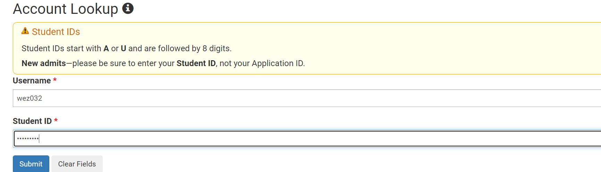

Lab Report 1
============

Back to [home](../index.md).

# Setting up your workspace

## Part 1: Installing VSCode

Visual Studio Code is a code editor for Windows, Linux or macOS with support for many languages, as well as all sorts of tools that might come in handy when coding. Here's how to install Visual Studio Code:

- Begin by navigating to the [Visual Studio Code website](https://code.visualstudio.com/) Download and install the suitable version for your operating system.

- Documentation for installing VS Code on multiple operating systems are available [here](https://code.visualstudio.com/docs/setup/setup-overview), if you need it.

- Your Visual Studio Code should look something like this after installation:


# Course-specific accounts at UCSD

Many courses at UCSD make use of course-specific accounts. Before you can make use of your course-specific account, you will have to set your password.

You can do so by looking up your course-specific account [here](https://sdacs.ucsd.edu/~icc/index.php). 

- Enter your username (the part of your UCSD email before @ucsd.edu), and your student PID (Which starts with A) to look up the course-specific accounts under your name.



- Under **"Additional Accounts"**, you can find course-specific accounts. For CSE 15L in Winter 22, you will see something like `cs15lwi22xyz` where `xyz` will be replaced by the unique letters of your course-specific account.


- Now that you have the username of your course-specific account, you can proceed to set your password using [the password reset tool here](https://sdacs.ucsd.edu/~icc/password.php).

- Enter your **course-specific username** as your well as your **Student ID** once more.


- Enter your desired password as **both your Current Password and New Password**.

- Click on **Check Password**, followed by **Submit**

Your course-specific account should now be activated! You can now use it to remotely connect to the machines in the CSE building.

# Remote connection & SSH.

Often in work or school there will be good reason to work remotely by accessing files on another machine. One way to do so is by using SSH, also known as the Secure Shell protocol.

## Part 2: Remotely Connecting using SSH.

On Windows, you will first need to install OpenSSH. To do so (Steps from [Windows' tutorial here](https://docs.microsoft.com/en-us/windows-server/administration/openssh/openssh_install_firstuse)):

- Open **Settings**, select **Apps** > **Apps and Features**, then select **Optional Features**

- Scan the list to see if the OpenSSH is already installed. If not, at the top of the page, select **Add a feature**, then select and install both **OpenSSH Client** and **OpenSSH Server**

Once done, your settings page should look something like this:


___

We will be using Visual Studio Code to establish the remote connection. 

- First, open a VSCode Terminal (Ctrl/Command + \`, or **Terminal -> New Terminal**) and use the following command, replacing `xyz` with the letters in your course-specific account:

```
ssh cs15lwi22xyz@ieng6.ucsd.edu
```

When connecting to a server for the first time, a message like this should appear:

``` The authenticity of host 'ieng6.ucsd.edu (128.54.70.238)' can't be established.
RSA key fingerprint is SHA256:ksruYwhnYH+sySHnHAtLUHngrPEyZTDl/1x99wUQcec.
Are you sure you want to continue connecting (yes/no/[fingerprint])?
```

- Enter `yes` to proceed. Next, enter the password for your course-specific account as prompted.

```
Password:
```

Note that no extra characters will show up in the terminal as you type or paste your password. Don't worry, this is normal. Your password is still being entered as normal. The characters are merely hidden.

A successful login looks something like this:

```
Last login: Fri Jan 14 16:28:51 2022 from 100.83.33.11
quota: No filesystem specified.
Hello cs15lwi22xyz, you are currently logged into ieng6-201.ucsd.edu

You are using 0% CPU on this system

Cluster Status 
Hostname     Time    #Users  Load  Averages  
ieng6-201   16:25:01   31  3.78,  3.54,  3.42
ieng6-202   16:25:01   30  6.67,  6.61,  6.66
ieng6-203   16:25:01   19  2.25,  2.62,  2.50


Fri Jan 14, 2022  4:29pm - Prepping cs15lwi22
[cs15lwi22xyz@ieng6-201]:~:76$
```

Congratulations, you are now connected to one of the computers in the CSE basement! Any commands you enter now will be run on that computer (the **server**) instead of locally on your machine (the **client**).

## Part 3: Trying some commands

If you have used linux before, these commands might be familiar to you. If not, a list of useful commands for navigating the terminal can be found [here](fwunixref.pdf).

Here are some useful ones to consider:

`pwd` - Print the path to the current directory.

`ls <dir>` - Prints the contents of the directory. Prints the current directory if a path is not provided.

`cd <dir>` - Change directory to the directory provided. If no directory is provided, changes directory to the home directory.

`cp <file> <destination>` - Copy a file to the destination path

`mkdir <name>` - Create a directory with the name provided.

`exit` or `logout` both work to disconnect from the ssh connection.

Example:

```
[cs15lwi22xyz@ieng6-201]:~:96$ ls
WhereAmI.class  WhereAmI.java  perl5
[cs15lwi22xyz@ieng6-201]:~:97$ mkdir test
[cs15lwi22xyz@ieng6-201]:~:98$ ls
WhereAmI.class  WhereAmI.java  perl5  test
[cs15lwi22xyz@ieng6-201]:~:99$ cd test
[cs15lwi22xyz@ieng6-201]:test:100$ cd ..
[cs15lwi22xyz@ieng6-201]:~:102$ cp WhereAmI.java ~/test
[cs15lwi22xyz@ieng6-201]:~:103$ cd test
[cs15lwi22xyz@ieng6-201]:test:104$ ls
WhereAmI.java
[cs15lwi22xyz@ieng6-201]:test:105$
```

## Part 4: Moving files with `scp`

`scp`, or secure copy,  is a means of securely transferring files between two machines over SSH. Here's how to do it:

- From a terminal on your machine, use the command `scp <file name> cs15lwi22zz@ieng6.ucsd.edu:~/`, remembering to use your course-specific username.

- It'll prompt you for your password as per your usual SSH login, enter it as normal.

Your file should have successfully been copied to the home directory of your account on the machine! You can verify this by logging in via SSH once again, and using `ls` to print out the directory's contents:

```
PS C:\Users\weiyao\Documents\GitHub\cse15l-lab-reports\wk2-lab-report> ls

    Directory: C:\Users\weiyao\Documents\GitHub\cse15l-lab-reports\wk2-lab-report


----                 -------------         ------ ----
-a----         1/14/2022   3:48 PM          37305 AccountLookup.PNG
-a----          1/3/2022   9:43 AM          70752 fwunixref.pdf
-a----         1/14/2022   4:51 PM           6096 lab-report-1-week-2.md
-a----         1/14/2022   3:43 PM          26732 OpenSSH.PNG
-a----         1/14/2022   4:12 PM          80698 PWReset.PNG
-a----         1/14/2022   3:32 PM          24343 VSCode.PNG
-a----         1/14/2022   3:52 PM          53118 wezResults.PNG
```

> From my local machine, I want to transfer one of these PNG files to my working directory on the server.

```
PS C:\Users\weiyao\Documents\GitHub\cse15l-lab-reports\wk2-lab-report> scp VSCode.PNG cs15lwi22xyz@ieng6.ucsd.edu:~/
Password:
VSCode.PNG                                                                                   100%   24KB 398.4KB/s   00:00     
PS C:\Users\weiyao\Documents\GitHub\cse15l-lab-reports\wk2-lab-report> ssh cs15lwi22xyz@ieng6.ucsd.edu
Password: 
Last login: Fri Jan 14 16:29:10 2022 from 100.83.33.11
quota: No filesystem specified.
Hello cs15lwi22xyz, you are currently logged into ieng6-201.ucsd.edu

You are using 0% CPU on this system

Cluster Status 
Hostname     Time    #Users  Load  Averages  
ieng6-201   16:50:01   34  3.58,  3.70,  3.59
ieng6-202   16:50:01   24  7.32,  6.92,  6.72
ieng6-203   16:50:01   18  1.99,  2.06,  2.22

 
Fri Jan 14, 2022  4:54pm - Prepping cs15lwi22
[cs15lwi22xyz@ieng6-201]:~:106$ ls
VSCode.PNG  WhereAmI.class  WhereAmI.java  perl5  test
```
> Success! My file now appears when I call `ls` after logging in to the remote directory.

## Part 5: Setting an SSH key.

As you might have noticed, every time you try to establish a connection over SSH (including `scp`, which uses the SSH protocol), you are required to enter your password. This is nice and secure, but can quickly get tiresome when making the same SSH connection over and over again throughout a day's work.

SSH keys provide a solution: `ssh-keygen` creates a pair of files called the **public key** and **private key** that work together to provide authentication in place of a password.

*Note: Just as it is unsafe to use the same password across all of your accounts, **you should generate a new public/private key pair for every machine** that you connect from!*

Here's how to set it up:

- On a terminal on your machine, run `ssh-keygen`:

```
PS C:\Users\weiyao\Documents\GitHub\cse15l-lab-reports> ssh-keygen
Generating public/private rsa key pair.
Enter file in which to save the key (C:\Users\weiyao/.ssh/id_rsa): 
```
- You may choose to select a custom directory here, or just press enter for the default.

```
Enter passphrase (empty for no passphrase): 
Enter same passphrase again: 
Your identification has been saved in C:\Users\weiyao/.ssh/id_rsa.
Your public key has been saved in C:\Users\weiyao/.ssh/id_rsa.pub.
The key fingerprint is:
SHA256:9zJ5K6DBFVf+wP5njmr0jq2wbxeiHOa2QPzGVUd+qDY weiyao@LAPTOP-FJV7LLUO
The key's randomart image is:
+---[RSA 3072]----+
|           ..   .|
|        . .o   + |
|         o  + o +|
|       ..  . = ..|
|     . .S . E .  |
|      o..+o=oo.  |
|       o.=O+oo..o|
|      .  o**o+o= |
|         .o**=+ .|
+----[SHA256]-----+
```
Two files should now exist in the directory you specified: the private key `id_rsa` and public key `id_rsa.pub`.
___

Again, on Windows, there are a [few extra steps](https://docs.microsoft.com/en-us/windows-server/administration/openssh/openssh_keymanagement#user-key-generation):

- Run **Windows Powershell as Administrator** (*Different from your terminal in VSCode!*) and run `GGet-Service ssh-agent | Set-Service -StartupType Manual`

- Start the service with `Start-Service ssh-agent`

```
Windows PowerShell
Copyright (C) Microsoft Corporation. All rights reserved.

Try the new cross-platform PowerShell https://aka.ms/pscore6

PS C:\Windows\system32> Get-Service ssh-agent | Set-Service -StartupType Manual

```

- Verify the status of `ssh-agent` with `Get-Service ssh-agent`

```
PS C:\Windows\system32> Get-Service ssh-agent

Status   Name               DisplayName
------   ----               -----------
Running  ssh-agent          OpenSSH Authentication Agent

```
- Now load your private key file into `ssh-agent` with `ssh-add <path to key>`. If you set up a passphrase, enter it here.

```
PS C:\Windows\system32> ssh-add C:\Users\weiyao\.ssh\id_rsa
Enter passphrase for C:\Users\weiyao\.ssh\id_rsa:
Identity added: C:\Users\weiyao\.ssh\id_rsa (weiyao@LAPTOP-FJV7LLUO)
PS C:\Windows\system32>
```

In short, `ssh-agent` here acts like a password manager (key manager!) for your private key. After adding your private key to ssh-agent, it's recommended to back up your private key to a **secure location**, before **deleting it from your local system**. This will help preventing your private key from falling into the wrong hands.
___

With your public and private key ready:

- Copy the **public key** to the `.ssh` directory of your account on the server. (You probably need to create such a directory first!)

```
PS C:\Users\weiyao\Documents\GitHub\cse15l-lab-reports> ssh cs15lwi22xyz@ieng6.ucsd.edu
Password: 
Last login: Fri Jan 14 17:24:42 2022 from 100.83.33.11
quota: No filesystem specified.
Hello cs15lwi22xyz, you are currently logged into ieng6-201.ucsd.edu

You are using 0% CPU on this system

Cluster Status 
Hostname     Time    #Users  Load  Averages  
ieng6-201   17:20:01   27  3.25,  3.35,  3.38
ieng6-202   17:20:01   15  6.71,  6.83,  6.78
ieng6-203   17:20:01   14  3.05,  2.63,  2.43

 
Fri Jan 14, 2022  5:25pm - Prepping cs15lwi22
[cs15lwi22xyz@ieng6-201]:~:109$ mkdir .ssh
[cs15lwi22xyz@ieng6-201]:~:110$ logout
Connection to ieng6.ucsd.edu closed.
PS C:\Users\weiyao\Documents\GitHub\cse15l-lab-reports> scp C:\Users\weiyao\.ssh\id_rsa.pub cs15lwi22xyz@ieng6.ucsd.edu:~/.ssh/authorized_keys
Password: 
id_rsa.pub                                                                                   100%  577   148.3KB/s   00:00    
PS C:\Users\weiyao\Documents\GitHub\cse15l-lab-reports> 
```

Now, using `ssh` to access the server from this machine should no longer prompt you for a password!

```
PS C:\Users\weiyao\Documents\GitHub\cse15l-lab-reports> ssh cs15lwi22xyz@ieng6.ucsd.edu
Last login: Fri Jan 14 17:28:35 2022 from 100.83.33.11
quota: No filesystem specified.
Hello cs15lwi22xyz, you are currently logged into ieng6-201.ucsd.edu

You are using 0% CPU on this system

Cluster Status 
Hostname     Time    #Users  Load  Averages  
ieng6-201   17:25:01   28  3.12,  3.34,  3.37
ieng6-202   17:25:01   17  6.32,  6.61,  6.71
ieng6-203   17:25:01   16  2.18,  2.55,  2.46

 
Fri Jan 14, 2022  5:28pm - Prepping cs15lwi22
[cs15lwi22xyz@ieng6-201]:~:117$ 
```

## Part 6: Optimizing Remote Running.

Now, there are many tips and tricks to making remote running as pleasant as possible. Expect this page to be updated as I discover them. Here's some that you can consider:

- Separate commands with a semicolon `;` to run multiple commands in a single line
```
[cs15lwi22xyz@ieng6-201]:~:122$ javac WhereAmI.java; java WhereAmI
Linux
cs15lwi22xyz
/home/linux/ieng6/cs15lwi22/cs15lwi22xyz
/home/linux/ieng6/cs15lwi22/cs15lwi22xyz
```

- Add commands in quotations to the end of an `ssh` command to run them remotely, then immediately disconnect.
```
PS C:\Users\weiyao\Documents\GitHub\cse15l-lab-reports> ssh cs15lwi22xyz@ieng6.ucsd.edu 'javac WhereAmI.java; java WhereAmI'   
Linux
cs15lwi22xyz
/home/linux/ieng6/cs15lwi22/cs15lwi22xyz
/home/linux/ieng6/cs15lwi22/cs15lwi22xyz
```

Remember, **up and down arrow keys** are your best friends: They allow you to access possibly lengthy commands saved in history!