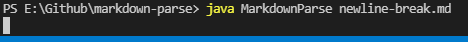

Lab Report 2
============

Back to [home](../index).

# Bugs, Symptoms, and how we fixed them.

Over the past few weeks, we've examined and fixed a few bugs in the [MarkdownParse.java program](https://github.com/zfxd/markdown-parse) during our labs. Here's a record of the process.

## Problem 1: `newline-break`
We noticed that [adding a newline to the existing test file](](https://github.com/zfxd/markdown-parse/blob/main/newline-break.md)) resulted in an unexpected behavior - an infinite loop:



We made the following change to the code:


Which gave us the desired output:

```
PS E:\Github\markdown-parse> java MarkdownParse newline-break.md
[https://something.com, some-page.html]
```

What's happening here is that whenever our last `openParen` is at an index strictly lesser than `markdown.length`, the loop restarts. When this happens near the end of the file and there is no `nextOpenBracket` found, `nextOpenBracket` will be set to -1, the return value when the desired character is not found. 

`nextOpenBracket`, `openParen` and `closeParen` will then start searching from the start of the file once more, and set `currentIndex` back to an earlier point in the file. Thus `currentIndex` is constantly getting reset to a lower value, and the conditions to exit the while loop are never met, resulting in an infinite loop.

## Problem 2: `image-break`

For a file [containing an image](https://github.com/zfxd/markdown-parse/blob/main/image-break.md), the program erroneously reports these images as links instead:


Here's our change to the code:


In markdown, links are of the format `[link text](link destination)` while images follow the format `` - quite similar! This is why our program is picking up on the images as links. We weren't checking whether or not there was a `!` immediately before our square brackets. This is what the change in our code does.

However...

## Problem 3: String index out of range.

Attempting to run our fix [using the same file](https://github.com/zfxd/markdown-parse/blob/main/image-break.md) caused another strange output!


It just so happens that our first link in `image-break.md` happened to be the very first part of our file; `nextOpenBracket` is at index 0. Thus, our code:

```
...markdown.charAt(nextOpenBracket-1)...
```

Attempts to access the character at index `-1`! That's an edge case we need to remember to handle with our fix:


And now, when we run our code, we get the expected output for `image-break.md`

```
PS E:\Github\markdown-parse> java MarkdownParse image-break.md
[workinglink.com]
```

For our current test files, the program seems to produce the expected output:

```
PS E:\Github\markdown-parse> java MarkdownParse image-break.md
[workinglink.com]
PS E:\Github\markdown-parse> java MarkdownParse newline-break.md  
[https://something.com, some-page.html]
PS E:\Github\markdown-parse> java MarkdownParse test-file.md    
[https://something.com, some-page.html]
PS E:\Github\markdown-parse>
```

There is plenty more testing to do, and during the lab we also set up JUnit tests in order to help automate the process. Listed above is our process for the first three bug fixes.