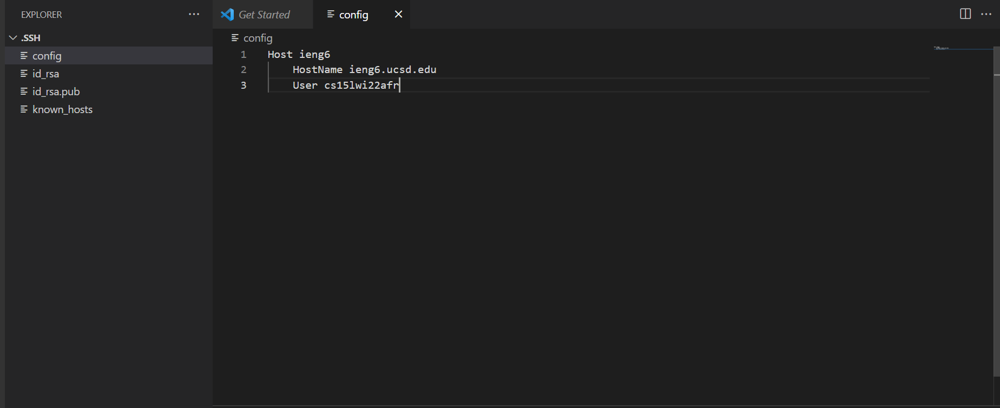

Lab Report 3
============

Back to [home](../index).

# Streamlining ssh Configuration

So far, logging in to `ieng6` via ssh requires you to type:

```
ssh cs15lwi22zzz@ieng6.ucsd.edu
```

That's long, complicated, and prone to typos! Luckily there's a way to set a 'nickname' to this specific connection, so you can login with a much shorter alias.

First, navigate to `~/.ssh` on your local machine, and edit the `config` file in this directory, creating it if it doesn't exist. (Note: This file has no file extension!)

Within it, add:

```
Host ieng6
    HostName ieng6.ucsd.edu
    User cs15lwi22zzz (use your username)
```

Here I've edited it in visual studio code.



Afterwards, you should be able to login with just the alias `ieng6`, as below:

```
PS C:\Users\weiyao\Documents\GitHub\cse15l-lab-reports> ssh ieng6
Last login: Thu Feb 10 10:33:43 2022 from 128.54.195.228
quota: No filesystem specified.
Hello cs15lwi22afr, you are currently logged into ieng6-202.ucsd.edu

You are using 0% CPU on this system

Cluster Status 
Hostname     Time    #Users  Load  Averages  
ieng6-201   13:25:01   36  0.49,  0.57,  0.62
ieng6-202   13:25:01   28  2.02,  1.70,  1.63
ieng6-203   13:25:01   41  1.99,  2.64,  2.61


Fri Feb 11, 2022  1:26pm - Prepping cs15lwi22
[cs15lwi22afr@ieng6-202]:~:254$
```

You may also use the alias you set for commands such as `scp`:

```
PS C:\Users\weiyao\Documents\GitHub\cse15l-lab-reports> scp index.md ieng6:~/
index.md                                                                               100%  337    37.6KB/s   00:00     
PS C:\Users\weiyao\Documents\GitHub\cse15l-lab-reports> ssh ieng6
Last login: Fri Feb 11 13:26:49 2022 from 100.83.77.59
quota: No filesystem specified.
Hello cs15lwi22afr, you are currently logged into ieng6-202.ucsd.edu

You are using 0% CPU on this system

Cluster Status
Hostname     Time    #Users  Load  Averages
ieng6-201   13:25:01   36  0.49,  0.57,  0.62
ieng6-202   13:25:01   28  2.02,  1.70,  1.63
ieng6-203   13:25:01   41  1.99,  2.64,  2.61


Fri Feb 11, 2022  1:29pm - Prepping cs15lwi22
[cs15lwi22afr@ieng6-202]:~:254$ ls
VSCode.PNG      WhereAmI.java       index.md        perl5  skill-demonstration    test
WhereAmI.class  cse15l-lab-reports  markdown-parse  scp    skill-demonstration-1
[cs15lwi22afr@ieng6-202]:~:255$
```

Note: In your config file, `ieng6` after `Host:` can be set to any alias you'd like to use in place of your username.