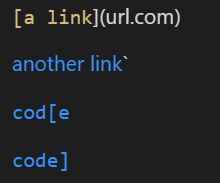
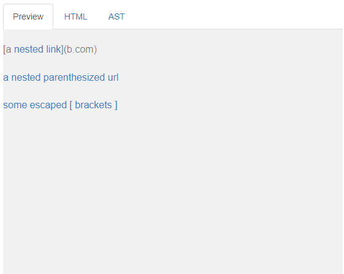
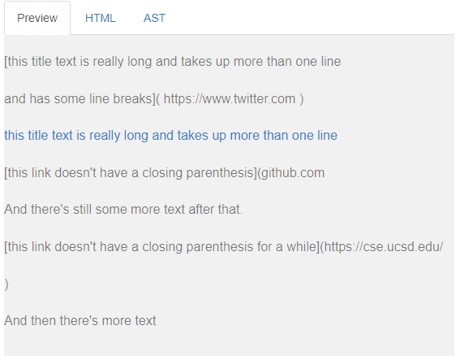

Lab Report 4
============

Back to [home](../index).

# Testing more `markdown-parse` behavior

Today we will be examining the behavior of 3 code snippets on both my [own markdown-parse code](https://github.com/zfxd/markdown-parse/tree/a1bacd513c640c31d35f1cc61e2123fb29343d01) as well as [Anthony Truong's version of markdown-parse](https://github.com/atruong39/markdown-parse/tree/730e5d8ccd774f33e79b532f49b4dc3acc707d02).

## Snippet 1:

```
`[a link`](url.com)

[another link](`google.com)`

[`cod[e`](google.com)

[`code]`](ucsd.edu)
```

Here's how it should look, according to the [CommonMark demo site](https://spec.commonmark.org/dingus/):



Note that the last two links appear in the code format, but are still clickable links.

Every link except the first is a valid link, so we should expect: ``[`google.com, google.com, ucsd.edu]``

Now to turn this file, saved as `snippet1.md`, into a test case:

```
    @Test
    public void testSnippet1() throws IOException {
        String contents = Files.readString(Path.of("./snippet1.md"));
        List<String> expect = List.of("`google.com", "google.com", "ucsd.edu");
        assertEquals(expect, MarkdownParse.getLinks(contents));
    }
```

My implementation fails the test, picking up every link as a valid link:

```
1) testSnippet1(MarkdownParseTest)
java.lang.AssertionError: expected:<[`google.com, google.com, ucsd.edu]> but was:<[url.com, `google.com, google.com, ucsd.edu]>
        at org.junit.Assert.fail(Assert.java:89)
        at org.junit.Assert.failNotEquals(Assert.java:835)
        at org.junit.Assert.assertEquals(Assert.java:120)
        at org.junit.Assert.assertEquals(Assert.java:146)
        at MarkdownParseTest.testSnippet1(MarkdownParseTest.java:18)
```

Anthony's implementation also failed in the same way:

```
1) testSnippet1(MarkdownParseTest)
java.lang.AssertionError: expected:<[`google.com, google.com, ucsd.edu]> but was:<[url.com, `google.com, google.com, ucsd.edu]>
        at org.junit.Assert.fail(Assert.java:89)
        at org.junit.Assert.failNotEquals(Assert.java:835)
        at org.junit.Assert.assertEquals(Assert.java:120)
        at org.junit.Assert.assertEquals(Assert.java:146)
        at MarkdownParseTest.testSnippet1(MarkdownParseTest.java:153)
```

**Do you think there is a small (<10 lines) code change that will make your program work for snippet 1 and all related cases that use inline code with backticks? If yes, describe the code change. If not, describe why it would be a more involved change.**

Yes, I think there is a way to make my program work for snippet 1 and all related cases that use inline code with backticks. Because backticks take priority over links, I can use a few lines of code to check for the next backtick: if this next backtick is at an index *before* the next open bracket, I will drop everything and handle the backticks first - finding the corresponding backtick that indicates the end of the `code` text, before setting currentIndex to the next index - essentially skipping over any other formatting that might have been present inside the `code`, because markdown ignores those.

## Snippet 2:

```
[a [nested link](a.com)](b.com)

[a nested parenthesized url](a.com(()))

[some escaped \[ brackets \]](example.com)
```

Here's how it should look:



So 3 links are present, and we expect: `[a.com, a.com(()), example.com]`

Now to turn this file, saved as `snippet2.md`, into a test case:

```
    @Test
    public void testSnippet2() throws IOException {
        String contents = Files.readString(Path.of("./snippet2.md"));
        List<String> expect = List.of("a.com", "a.com(())", "example.com");
        assertEquals(expect, MarkdownParse.getLinks(contents));
    }
```

My implementation's fails:

```
2) testSnippet2(MarkdownParseTest)
java.lang.AssertionError: expected:<[a.com, a.com(()), example.com]> but was:<[a.com, a.com((, example.com]>
        at org.junit.Assert.fail(Assert.java:89)
        at org.junit.Assert.failNotEquals(Assert.java:835)
        at org.junit.Assert.assertEquals(Assert.java:120)
        at org.junit.Assert.assertEquals(Assert.java:146)
        at MarkdownParseTest.testSnippet2(MarkdownParseTest.java:25)
```

Anthony's also fails this test, but in a different way. It picks up the outer link `b.com` instead of the nested `a.com` as expected, but is able to handle the nested parentheses in the url and escaped brackets:

```
2) testSnippet2(MarkdownParseTest)
java.lang.AssertionError: expected:<[a.com, a.com(()), example.com]> but was:<[b.com, a.com(()), example.com]>
        at org.junit.Assert.fail(Assert.java:89)
        at org.junit.Assert.failNotEquals(Assert.java:835)
        at org.junit.Assert.assertEquals(Assert.java:120)
        at org.junit.Assert.assertEquals(Assert.java:146)
        at MarkdownParseTest.testSnippet2(MarkdownParseTest.java:160)
```

**Do you think there is a small (<10 lines) code change that will make your program work for snippet 2 and all related cases that nest parentheses, brackets, and escaped brackets? If yes, describe the code change. If not, describe why it would be a more involved change.**

No. For nested parentheses, we could use a helper method like the `findCloseParen` to find the corresponding closed parenthesis/brackets for each open bracket/parenthesis, but that method alone is more than 10 lines. For escaped brackets, we would have to check for the escape character `\` before every important character, and somehow ignore it. This might require less code, but probably requires a lot of if/else statements, one for each relevant character.

## Snippet 3:

```
[this title text is really long and takes up more than 
one line

and has some line breaks](
    https://www.twitter.com
)

[this title text is really long and takes up more than 
one line](
    https://ucsd-cse15l-w22.github.io/
)


[this link doesn't have a closing parenthesis](github.com

And there's still some more text after that.

[this link doesn't have a closing parenthesis for a while](https://cse.ucsd.edu/


)

And then there's more text
```

Here's how it should look:



Only one link is valid, so we should expect: `[https://ucsd-cse15l-w22.github.io/]`

Now to turn this file, saved as `snippet3.md`, into a test case:

```
    @Test
    public void testSnippet3() throws IOException {
        String contents = Files.readString(Path.of("./snippet3.md"));
        List<String> expect = List.of("https://ucsd-cse15l-w22.github.io/");
        assertEquals(expect, MarkdownParse.getLinks(contents));
    }
```

For each implementation,

My implementation failed spectacularly:

```
3) testSnippet3(MarkdownParseTest)
java.lang.AssertionError: expected:<[https://ucsd-cse15l-w22.github.io/]> but was:<[
    https://www.twitter.com
,
    https://ucsd-cse15l-w22.github.io/
, github.com

And there's still some more text after that.

[this link doesn't have a closing parenthesis for a while](https://cse.ucsd.edu/


]>
        at org.junit.Assert.fail(Assert.java:89)
        at org.junit.Assert.failNotEquals(Assert.java:835)
        at org.junit.Assert.assertEquals(Assert.java:120)
        at org.junit.Assert.assertEquals(Assert.java:146)
        at MarkdownParseTest.testSnippet3(MarkdownParseTest.java:32)
```
Anthony's implementation failed to detect any valid links:

```
3) testSnippet3(MarkdownParseTest)
java.lang.AssertionError: expected:<[https://ucsd-cse15l-w22.github.io/]> but was:<[]>
        at org.junit.Assert.fail(Assert.java:89)
        at org.junit.Assert.failNotEquals(Assert.java:835)
        at org.junit.Assert.assertEquals(Assert.java:120)
        at org.junit.Assert.assertEquals(Assert.java:146)
        at MarkdownParseTest.testSnippet3(MarkdownParseTest.java:167)
```

**Do you think there is a small (<10 lines) code change that will make your program work for snippet 3 and all related cases that have newlines in brackets and parentheses? If yes, describe the code change. If not, describe why it would be a more involved change.**

To fix this bug in my code, I feel like I would need to completely rewrite my current approach to handling links in the code. Instead of naively taking each character index by index and using a lot of if/else statements to handle special cases for each character, I should extract a list of possible links and link titles from the input, *then* sort through them to identify valid links and link titles (and the presence of invalid characters such as `\n` or whitespaces in the middle of links), which would probably take more than 10 lines of code.