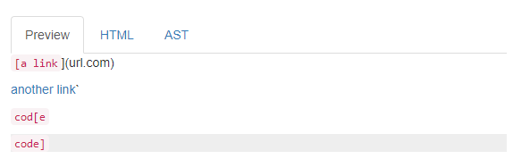

Lab Report 4
============

Back to [home](../index).

# More tests on markdown-parse

Today we will be examining the behavior of 3 code snippets on both my [own markdown-parse code](link) as well as [another one](link).

## Snippet 1:

```
`[a link`](url.com)

[another link](`google.com)`

[`cod[e`](google.com)

[`code]`](ucsd.edu)
```

Here's how it should look, according to VSCode:



So, the first link is invalid, but all the other links are valid, producing the links: `["\`google.com", "google.com","ucsd.edu"]`